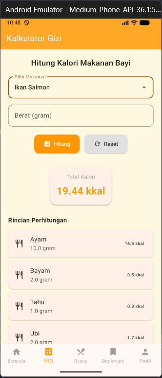
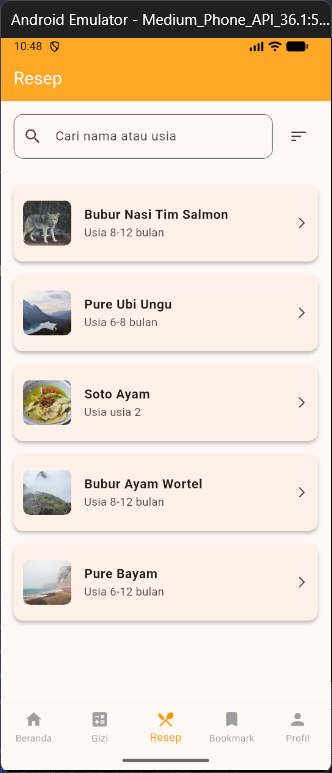

# MPASI App

**Tugas Pemrograman Bergerak**    
**Nama:** Erfia Nadia Safari  
**NIM:** 2205101081  

---

## Deskripsi Proyek

**MPASI Care** membantu orang tua menyiapkan menu **Makanan Pendamping ASI (MPASI)** yang sehat, bergizi, dan sesuai dengan tahapan usia bayi secara praktis.

Aplikasi berbasis Flutter ini dirancang sebagai panduan MPASI yang mudah digunakan oleh orang tua. MPASI Care menyediakan berbagai resep MPASI yang disusun secara terstruktur berdasarkan usia bayi, dilengkapi dengan fitur bookmark untuk menyimpan resep favorit serta kalkulator gizi sederhana untuk membantu memperkirakan kebutuhan nutrisi bayi. Dengan tampilan yang sederhana dan ramah pengguna, MPASI Care diharapkan dapat menjadi pendamping orang tua dalam mendukung tumbuh kembang anak secara optimal.


## Persiapan & Instalasi

1. Pastikan Flutter sudah terpasang di komputer Anda.  
2. Clone repository ini:  
    ```bash
    git clone https://github.com/erfiaaans/MPASI-APP
    ```
3. cd mpasi_app
4. flutter run

## Tampilan Aplikasi

<table>
  <tr>
    <td align="center">
      <br>
      Beranda
    </td>
    <td align="center">
      <br>
      Kalkulator Gizi
    </td>
  </tr>
  <tr>
    <td align="center">
      <br>
      Resep
    </td>
    <td align="center">
      <br>
      Bookmark
    </td>
  </tr>
</table>

