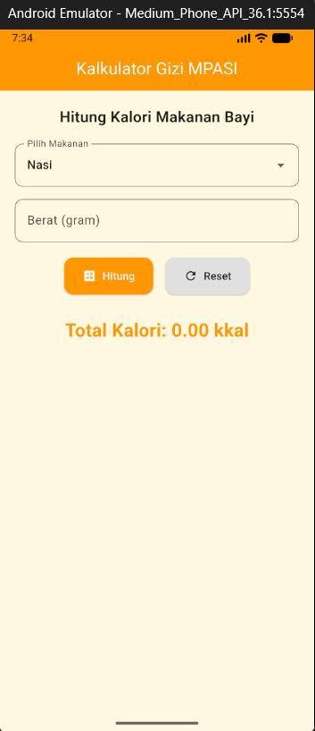

# MPASI App

**Tugas Pemrograman Bergerak**    
**Nama:** Erfia Nadia Safari  
**NIM:** 2205101081  

---

## Deskripsi Proyek

MPASI App adalah aplikasi berbasis Flutter yang bertujuan membantu orang tua dalam memberikan **Makanan Pendamping ASI (MPASI)** kepada bayi dengan cara yang lebih praktis. Aplikasi ini menyediakan fitur-fitur seperti resep MPASI, bookmark resep favorit, dan kalkulator gizi sederhana.

---

## Persiapan & Instalasi

1. Pastikan Flutter sudah terpasang di komputer Anda.  
2. Clone repository ini:  
    ```bash
    git clone https://github.com/erfiaaans/MPASI-APP
    ```
3. cd mpasi_app
4. flutter run

## Tampilan Aplikasi

### Kalkulator Gizi
